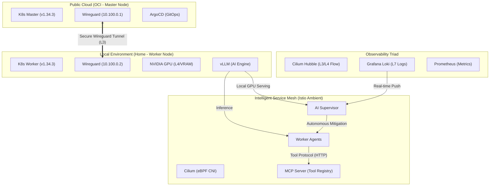

# Portfolio: Enterprise Hybrid-Cloud AIOps & Autonomous Security Platform

## 1. Project Vision
단일 클라우드를 넘어 **OCI(Oracle Cloud)와 On-Premise(Home/WSL2)를 통합**하고, **eBPF 기반의 고성능 네트워킹**과 **AI 자율 판단**이 결합된 엔터프라이즈급 하이브리드 AIOps 플랫폼을 구축했습니다.

## 2. Hybrid-Cloud Architecture (The Big Picture)

## 3. 핵심 기술 스택 및 구현 성과

### 🌐 Hybrid Cloud Connectivity (Wireguard)
*   OCI 인스턴스와 로컬 워커 간에 **Wireguard VPN 터널**을 구축하여 지리적으로 분리된 환경을 하나의 투명한 L2/L3 네트워크로 통합했습니다.
*   **보안 전송**: 클라우드 간 통신은 커널 레벨의 초고속 암호화 터널을 통과하여 비인과적인 외부 접근으로부터 안전합니다.

### 🔌 Universal Connectivity (Model Context Protocol - MCP)
*   **"The USB for AI"**: Anthropic이 제안한 MCP 표준을 조기 도입하여, AI 에이전트(두뇌)와 도구(손발)를 완벽하게 분리했습니다.
*   **Plug-n-Play Extensibility**: `worker-agent` 코드를 수정하지 않고도, MCP 서버에 새로운 툴(Slack, GitHub, Postgres 등)을 등록하기만 하면 즉시 능력이 확장되는 아키텍처를 구현했습니다.
*   **Security Boundary**: 툴 실행 권한을 MCP 서버 레벨에서 격리하여, 에이전트의 오작동이 시스템 전체로 전파되는 것을 물리적으로 차단합니다.

### 🚀 Advanced Networking (Cilium & Istio Ambient Mesh)
*   **Sidecar-less Service Mesh**: Istio Ambient Mode를 도입하여, 기존 사이드카 패턴(Envoy Injection)의 리소스 오버헤드와 복잡성을 제거했습니다.
    *   **Ztunnel**: 노드 레벨에서 mTLS와 L4 보안을 투명하게 처리 (No Pod Restart required).
    *   **Waypoint Proxy**: 필요한 경우에만 L7(HTTP) 정책을 적용하여 리소스 효율성 극대화.
*   **eBPF 파워**: Cilium CNI를 통해 전통적인 iptables의 오버헤드를 제거하고, 커널 레벨에서 고성능 패킷 처리를 구현했습니다.
*   **Hubble 가시성**: L3/L4 레벨의 네트워크 흐름을 실시간으로 추적하여, 에이전트 간의 정식 통신 여부를 시각적으로 감시합니다.

### 📊 Integrated Observability (Grafana)
*   **Single Pane of Glass**: 수퍼바이저의 위협 판독 결과(Flash Analysis)와 워커 에이전트의 상태를 실시간 시각화하는 커스텀 Grafana 대시보드 구축.
*   **RAG & Memory Visualization**: 에이전트의 장기 기억(Vector DB) 상태와 AI의 추론 과정을 투명하게 모니터링.

### 🛡️ Autonomous Security Loop (Active Defense)
*   **Event-Driven Response**: Loki Ruler와 수퍼바이저의 웹훅을 연동하여, 위협 감지 시 **1초 이내에 자동 분석(Flash Analysis)**이 시작되는 실시간 대응 체계를 완성했습니다.
*   **Red Team Verified**: 실제 공격 시나리오를 통해 방어 능력을 검증했습니다.
    *   **권한 탈취 시도**: `read_system_secret` 도구 호출 시 RBAC에 의해 **즉시 차단(Block)**됨을 확인.
    *   **기밀 유출 감지**: 코드 취약점으로 인해 데이터가 유출될 경우, Supervisor가 **60초 내에 해당 에이전트를 사살(Kill)**하여 피해 확산을 물리적으로 차단.
    *   **Prompt Injection**: LLM의 검열 우회 시도(API Key 유출)에 대해 사후 탐지 및 격리 프로세스 가동.

### 🧠 Real-time Intelligence (Local vLLM)
*   **Private AI Engine**: 클라우드 API(OpenAI 등)에 의존하지 않고, 로컬 GPU(NVIDIA L4)에 **Qwen2.5-7B** 모델을 직접 서빙하여 데이터 주권을 확보했습니다.
*   **Zero-Latency Networking**: Kubernetes Service Mesh 내부에서 AI(vLLM)와 에이전트가 통신하므로, 외부 홉(Hop) 없이 초저지연 추론이 가능합니다.

### ⚖️ Competitive Advantage (Market Comparison)
| Feature | AIOps Platform (Ours) | K8sGPT / Robusta |
| :--- | :--- | :--- |
| **Model Context Protocol** | ✅ **Native Support** (First-mover) | ❌ Custom Plugins only |
| **Security Posture** | ✅ **Active Defense** (Kill Switch) | ⚠️ Passive Monitoring (Alerting) |
| **AI Privacy** | ✅ **100% On-Premise** (vLLM) | ⚠️ SaaS Dependant (OpenAI API) |
| **Architecture** | ✅ **Autonomous Agents** (Worker + Supervisor) | ⚠️ Operator / ChatBot pattern |

## 4. Technical Innovations & Versatility
*   **Hybrid RAG Pipeline**: 클라우드의 제어력과 로컬의 자원(GPU)을 결합한 최적화된 RAG 시스템.
*   **Pluggable Agent Architecture**: 표준 라벨링 프로토콜을 통해 Nginx, Python App, Go Microservice 등 어떠한 워크로드도 AI Ops의 보호를 받을 수 있는 높은 범용성 제공.
*   **Self-Healing Infrastructure**: AI가 스스로 보안 위협을 판단하고 파드를 정화(재시작)하는 자가 치유 시스템.

## 5. 결론
본 프로젝트는 **"AI + Security + Hybrid Cloud"**라는 세 가지 난제를 하나의 유기적인 플랫폼으로 통합했습니다. 이는 단순한 자동화를 넘어, 시스템 스스로가 사고하고 방어하는 **진정한 의미의 지능형 플랫폼(Cognitive Platform)**으로의 진화입니다.
